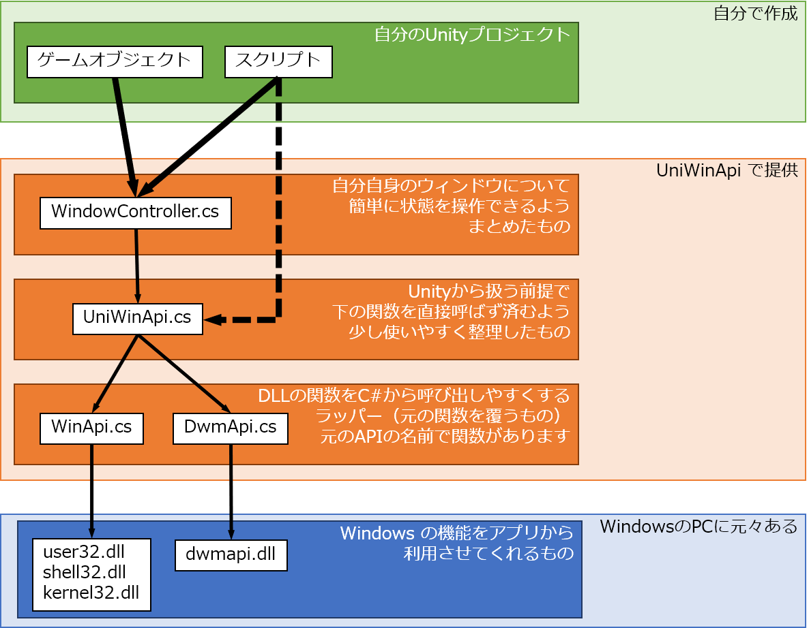
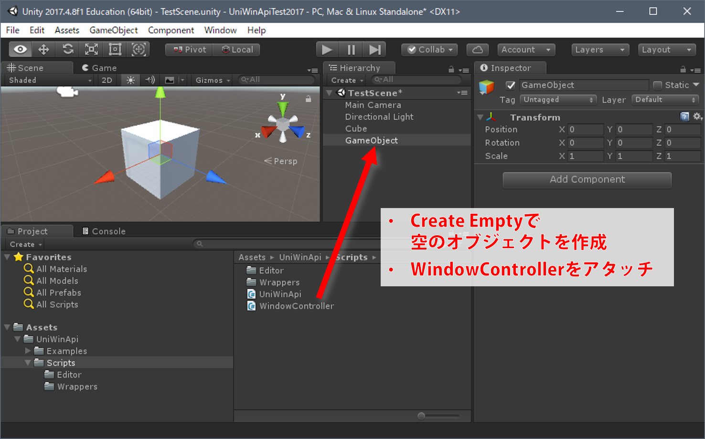

# UniWinApi チュートリアル

## 構成

UniWinApi の構成は図のようになっています。



利用する上では、黒い太矢印の部分を考えていただくことを想定しています。
* A. WindowController.cs を使う
* B. UniWinApi.cs をスクリプトから扱う

という2通りありますが、単に自分のウィンドウを枠なしにしたいということであれば、A. だけで大丈夫です。


## 使い方：自分のウィンドウを操作する

WindowController.cs を利用することで、自分のウィンドウについて操作ができます。

枠なしウィンドウ、すなわち描画されているピクセルのみを操作できるようにして、非矩形（四角形でない）ウィンドウのように扱う仕組みは、このクラスで行っています。


### 簡単な使い方　枠なしウィンドウにする

1. 適当なゲームオブジェクトに、WindowController.cs をアタッチする
	* アタッチ対象はなんでもよいのですが、複数アタッチはしないでください。挙動がおかしくなるかもしれません。
	* 空のオブジェクトに WindowController という名前を付けておき、それにアタッチするなどがお勧めです。

	

2. インスペクタで設定を変更
	* 「Is Transparent」にチェックを付けておけば、枠なしウィンドウになります。
	* 「Enable Drag Move」にチェックが入っていると、マウス左ボタンでのドラッグがウィンドウ移動になります。無効にしたい場合はチェックを外してください。

	

以上です。

エディタで再生中にインスペクタから変更することで、変化を確認できます。  
ただしエディタ上では枠なしにはなりません。最終的にはビルドをして確認する必要があります。


### スクリプトから操作する

実行中に設定を変更したい場合、スクリプトから WindowsController のインスタンスに対して操作してください。

例えば、次のような内容のスクリプトを、WindowController をアタッチしたのと同じゲームオブジェクトにアタッチしておくと、Endキーで枠なしを切り替えられます。

```c#
WindowController myWindowController;

Start() {
	myWindowController = GetComponent<WindowController>();
}

Update () {
	if (Input.GetKeyDown(KeyCode.End)) {
		myWindowController.isTransparent = !myWindowController.isTransparent;
	}
}
```


## 使い方：マウスを操作する

スクリプトから、Windows 上のマウスを動かしたり、ボタンを押させることができます。

